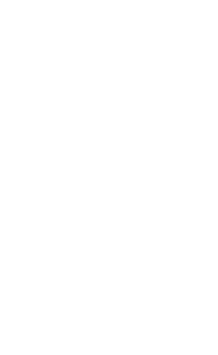
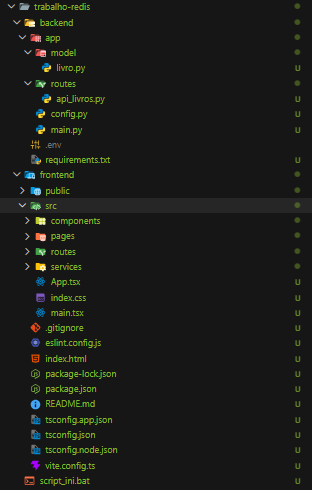
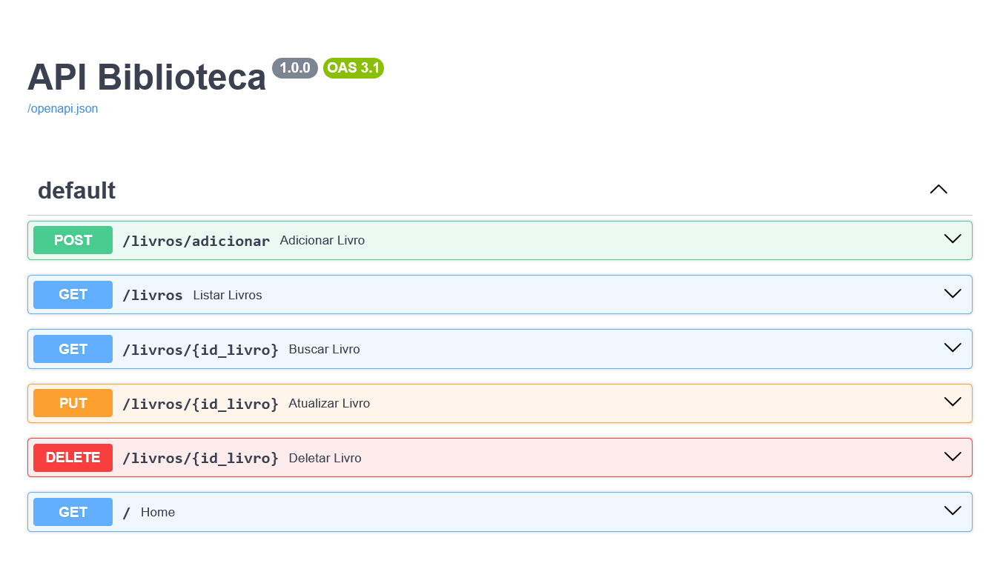

# dbnr
Repositório para a entrega da tarefa de Redis (CRUD API)

# Sistema de Gerenciamento de Biblioteca Digital

CRUD completo desenvolvido com FastAPI, Redis e frontend React JS para gerenciamento de livros em uma biblioteca digital.

## Tecnologias Utilizadas

### Backend

* Python
* FastAPI
* Redis
* Pydantic
* Uvicorn

### Frontend

* Vite
* React JS
* React Router DOM
* Axios

---

# Visão Geral do Projeto

O projeto consiste em uma API REST integrada a um banco de dados não relacional Redis, permitindo realizar operações CRUD de livros.

As funcionalidades principais incluem:

* Cadastro de livros
* Consulta de todos os livros
* Consulta de livro por ID
* Atualização de livro
* Exclusão de livro
* Controle de disponibilidade

---

# Modelagem de Dados

A modelagem utiliza Redis como banco de dados não relacional.


---

# Estrutura do Projeto

```bash
trabalho-redis/
│
├── backend/
│   ├── app/
│   │   ├── model/
│   │   │   └── livro.py
│   │   ├── routes/
│   │   │   └── api_livros.py
│   │   ├── config.py
│   │   └── main.py
│   ├── .env
│   ├── requirements.txt
│   └── venv/
│
├── frontend/
│
└── script_ini.bat
```

---

# Documentação da API

A FastAPI gera automaticamente uma interface de documentação interativa para os endpoints da aplicação.

Com o backend rodando, acesse:

```bash
http://127.0.0.1:8000/docs
```

Nessa interface é possível:

* Visualizar os endpoints
* Testar requisições
* Consultar parâmetros
* Ver respostas da API

## Endpoints

| Método | Endpoint            | Descrição             |
| ------ | ------------------- | --------------------- |
| GET    | `/`                 | Página inicial        |
| GET    | `/livros`           | Lista todos os livros |
| POST   | `/livros/adicionar` | Adiciona um livro     |
| GET    | `/livros/{id}`      | Consulta livro por ID |
| PUT    | `/livros/{id}`      | Atualiza livro        |
| DELETE | `/livros/{id}`      | Remove livro          |

---

# Como Executar o Projeto

## Pré-requisitos

Instale previamente:

* Python 3.x
* Node.js
* Redis Server

---

# 1. Clone o Repositório

```bash
git clone https://github.com/biancagante/dbnr.git
```

```bash
cd trabalho-redis
```

---

Lembre-se de criar um .env na pasta backend, ou mude as propriedades de conexão com o Redis

```bash
#  REDIS LOCAL CONEXÃO
REDIS_HOST=localhost
REDIS_PORT=6379
REDIS_DB=0
REDIS_PASSWORD=
```

---

# 2. Inicie o Redis

Execute o Redis localmente:

```bash
redis-server
```

---

# 3. Inicialização Automática

O projeto possui um script automático para facilitar a execução.

No terminal CMD:

```bash
.\script_ini.bat
```

O script:

* Verifica inicialização do projeto
* Cria a máquina virtual
* Instala dependências
* Abre frontend e backend automaticamente
* Executa os servidores

---

# Execução Manual

## Backend

Entre na pasta backend:

```bash
cd backend
```

Crie a máquina virtual:

```bash
python -m venv venv
```

Ative a venv:

### Windows

```bash
venv\Scripts\activate
```

Instale as dependências:

```bash
pip install -r requirements.txt
```

Inicie o servidor:

```bash
uvicorn app.main:app --reload
```

Backend disponível em:

```bash
http://127.0.0.1:8000/
```

---

## Frontend

Entre na pasta frontend:

```bash
cd frontend
```

Instale as dependências:

```bash
npm install
```

Execute o projeto:

```bash
npm run dev
```

Frontend disponível em:

```bash
http://localhost:5173/
```

---

# Exemplos de Requisição

## Cadastro de Livro

### POST `/livros/adicionar`

```json
{
  "titulo": "Dom Casmurro",
  "autor": "Machado de Assis",
  "categoria": "Romance",
  "ano_publicacao": 1899,
  "quantidade_disponivel": 5,
  "status": "Disponível"
}
```

---

# Imagens do Projeto

## Estrutura do Projeto



---

## Documentação da API FastAPI



---

# Fluxo do Sistema

```text
Frontend (React + Axios)
       ↓
FastAPI (Backend)
       ↓
Redis Database
```

# Desenvolvedoras

* Bianca Agante Tiene
* Maria Clara Magalhães

---

# Objetivo Acadêmico

Projeto desenvolvido para a disciplina de Banco de Dados Não Relacional, com foco em:

* CRUD com Redis
* APIs REST
* FastAPI
* Persistência NoSQL
* Integração frontend/backend
* Estruturas HASH no Redis

---

# Licença

Projeto desenvolvido para fins educacionais.
